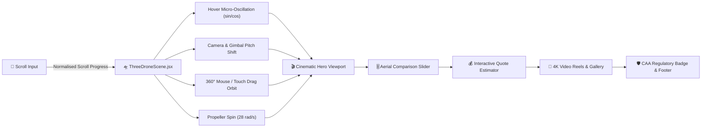

<div align="center">

  <!-- Animated Typing Header -->
  <a href="https://airvibe.uk">
    
  </a>

  <p align="center">
    <strong>Ultra-premium, interactive 3D WebGL drone cinematography portfolio crafted with React, Three.js, and cinematic physics.</strong>
  </p>

  <!-- Animated Shields & Status Badges -->
  <p align="center">
    <a href="https://github.com/udmodz0/uk-drone-portfolio/stargazers"></a>
    <a href="https://github.com/udmodz0/uk-drone-portfolio/network/members"></a>
    <a href="https://github.com/udmodz0/uk-drone-portfolio/blob/main/package.json"></a>
    <a href="https://threejs.org"></a>
    <a href="https://vitejs.dev"></a>
    <a href="https://www.caa.co.uk/"></a>
  </p>

  <!-- Live Capsule Preview -->
  

</div>

---

## ⚡ Flight Telemetry & Overview

```
 🛰️ AIRBORNE TELEMETRY // AIRVIBE FLEET
 ──────────────────────────────────────────────────────────────────
 OPERATING PLATFORM   : DJI Air 3S Dual-Camera Primary
 SENSOR SPECS         : 1" Primary CMOS (50MP) + 70mm Medium Telephoto (48MP)
 FLIGHT CEILING       : CAA 120m UK Altitude Compliant
 COLOR DEPTH          : 10-Bit D-Log M & HLG // 4K 60FPS HDR
 REGIONAL COVERAGE    : Newcastle Upon Tyne (NE3) • Sunderland • Durham
 SAFETY CLEARANCE     : CAA Flyer ID & Operator ID Compliant
 ──────────────────────────────────────────────────────────────────
```

---

## ✨ Cinematic Key Features

<table>
  <tr>
    <td width="50%">
      <h3 align="center">🛸 Interactive 3D WebGL Drone</h3>
      <p>Photorealistic 3D DJI Air 3S with physical carbon-fiber materials, continuous gyroscopic stabilization, interactive 360° mouse & touch drag orbit, and dynamic hotspot inspection pins.</p>
    </td>
    <td width="50%">
      <h3 align="center">🎚️ Real Aerial Comparison Slider</h3>
      <p>Interactive before/after drag divider comparing authentic ground-level photos against 50MP elevated drone cinema shots taken across live North East UK client events.</p>
    </td>
  </tr>
  <tr>
    <td width="50%">
      <h3 align="center">💰 Instant Event Quote Estimator</h3>
      <p>Real-time interactive quote calculator factoring flight hours, Newcastle/Sunderland/Durham travel radius, 4K reel add-ons, and instant 1-click WhatsApp quote dispatch.</p>
    </td>
    <td width="50%">
      <h3 align="center">🎬 Custom Direct 4K Video Player</h3>
      <p>Custom HTML5 video lightbox without third-party iframe bloat, complete with hover preview auto-streaming, keyboard <code>ESC</code> support, and synchronized play promise management.</p>
    </td>
  </tr>
</table>

---

## 🏗️ Architecture & 3D Flight Dynamics



---

## 🛠️ Technology Stack

<div align="center">

| Layer | Technologies |
| :--- | :--- |
| **Frontend Framework** | `React 18`, `JSX`, `Hooks` |
| **3D Graphics & Shaders** | `Three.js`, `WebGL`, `PerspectiveCamera`, `MeshStandardMaterial` |
| **Styling & Design System** | `Tailwind CSS`, `Custom Glassmorphism`, `Remix Icons (ri-*)` |
| **Tooling & Build System** | `Vite 5`, `PostCSS`, `Autoprefixer`, `ESLint` |
| **Media Delivery & CDNs** | Multi-tier failover (`catbox.moe` & `i.ibb.co`), Direct MP4 Stream Resolver |
| **Compliance & Safety** | UK CAA Airspace Regulation Standards, Sub-250g / C1 Protocols |

</div>

---

## 🚀 Quick Start & Local Setup

### 1. Clone the Repository
```bash
git clone https://github.com/udmodz0/uk-drone-portfolio.git
cd uk-drone-portfolio
```

### 2. Install Dependencies
```bash
npm install
```

### 3. Launch Development Server
```bash
npm run dev
```
> Open [http://localhost:3000](http://localhost:3000) in your browser to experience the live 3D drone viewport.

### 4. Build for Production
```bash
npm run build
```

---

## 📸 Authentic Portfolio Showcase

<div align="center">

| Newcastle Sports Pavilion (58m Altitude) | Durham Event Grounds (75m Altitude) | Sunderland 70mm Telephoto Action (42m) |
| :---: | :---: | :---: |
|  |  |  |
| *50MP Dual Lens Cinema* | *Full Perimeter Scale* | *Optical Subject Compression* |

</div>

---

## 📋 Available Packages

<details>
<summary><b>📦 Click to expand service packages & pricing</b></summary>

<br />

| Package | Coverage | Deliverables | Price |
| :--- | :--- | :--- | :--- |
| **Essential** | 2 Hours | 2 Edited Videos • 50 Edited Photos • 4K Drone | **£100** |
| **Premium (Most Popular)** | 4 Hours | 3 Edited Videos • 100 Edited Photos • Highlight Reel | **£250** |
| **Full Event VIP** | Up to 6 Hours | 5 Edited Videos • 200 Edited Photos • Cinematic Master | **£400** |
| **50MP Drone Photos** | Add-on | 10 High-Resolution 50MP Aerial Drone Photos | **£30** |
| **iPhone 17 Pro Ground** | Add-on | 10 ProRAW Ground Portraits & Candid Moments | **£25** |

</details>

---

## 🛡️ UK CAA Safety & Compliance

- ✅ **CAA Certified Operator & Pilot**: Fully registered with the UK Civil Aviation Authority.
- ✅ **Airspace Pre-flight Safety Checks**: Every flight site is checked against NOTAMs and flight restriction zones (FRZs).
- ✅ **Weather Protocols**: Strict operational adherence to maximum wind thresholds and precipitation safety.
- ✅ **Public Liability Protected**: Comprehensive coverage for peace of mind at private, commercial, and public events.

---

## 📞 Contact & Booking

<div align="center">

[](https://wa.me/447432266867?text=Hello%20AirVibe%20UK,%20I'd%20like%20to%20enquire%20about%20drone%20coverage)
[](https://github.com/udmodz0/uk-drone-portfolio)

**Location**: Newcastle upon Tyne (NE3) • Sunderland • Durham  
**Notice**: Advance booking of 1 week required for CAA airspace authorization.

</div>

---

<div align="center">
  <sub>Designed & engineered with precision for <strong>AirVibe UK</strong>. Built with React & Three.js.</sub>
</div>
